# MANUAL TÉCNICO

## COMPONENTES UTILIZADOS

- 1 Arduino Mega 

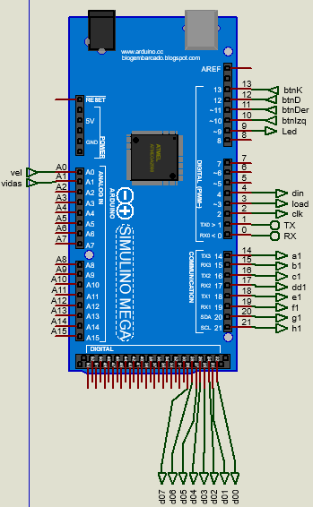 

- 2 Matrices LED de 8x8

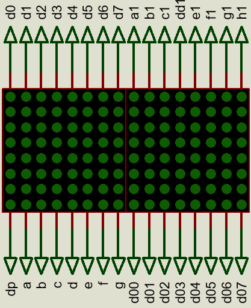

- 1 Driver Max7219

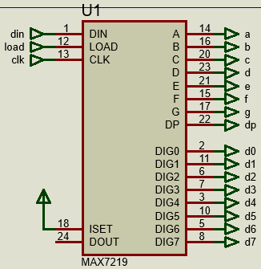

- 4 Push button

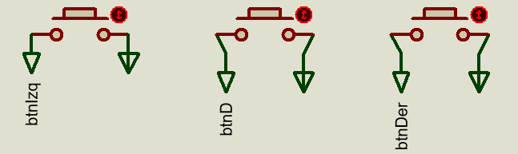
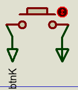

- 4 Resistencias

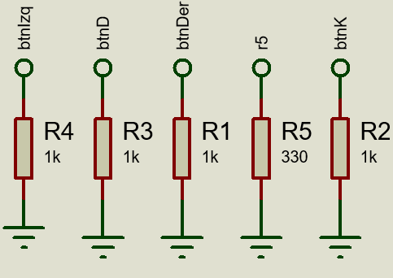

- 2 Potenciómetros

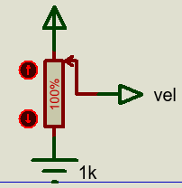
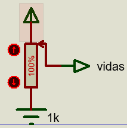

- 1 Led

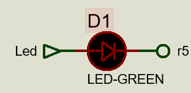

## CIRCUITO

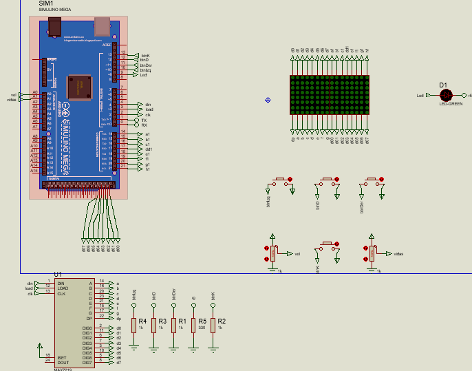

## REQUERIMIENTOS DEL SISTEMA
- Sistema operativo Windows o MacOs (windows 8.1 o superior)
- Proteus v8.12
- Librerias Simulino
- 8GB de ram (minimo)

## CODIGO UTILIZADO
### Librerias utilizadas
Se utilizó la librería LedControl para el manejo de la Matriz LED con el driver Max7219.

### Variables globales
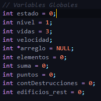  

### Funciones

#### Mostrar el mensaje Inicial

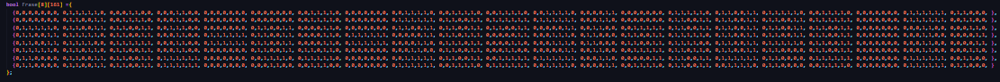
Se creó un array de tipo bool con el contendido del mensaje a mostrar.  
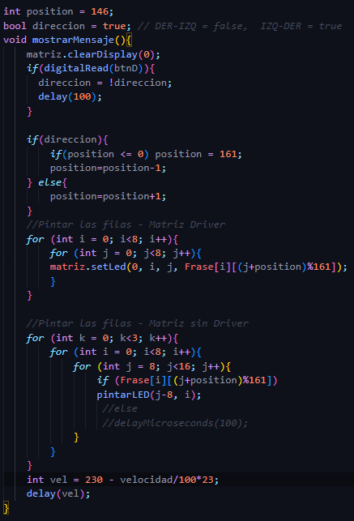  
Se limpia la matriz al principio, despues se verifica si se presionó el botón D para cambiar la dirección del mensaje, si la dirección es de derecha a izquierda cuando la posición sea 0 se pone la posición en 146, que es el inicio del mensaje, para que no haya problema con posiciones negativas. Se recorre el array en las posiciones dadas por los for y muestra el mensaje en la posicion actual en la matriz LED con driver y también en la matriz led sin driver. Se utiliza el modulo de 161 que es el tamaño del array, para que no acceda a una posicion mayor. Por útlimo se obtiene el valor de velocidad dado y se aplica un delay de acuerdo a ese valor.  

#### Creación de niveles

Para la creación de niveles se utilizó una función llamada  new_buildings(short level), esta función recibe el numero de nivel a mostrar para generar el numero de edificios correspondientes, por ejemplo si se tiene el nivel numero 12, este creará un total de 12 edificios, cabe mencionar que este recorre un for con una longitud del parametro recibido y selecciona una casilla de manera aleatoria para construir el edificio (verificando siempre que no este en uso), por ultimo este agrega una altura.

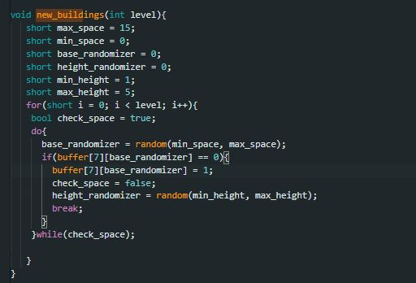

#### Destrucción de edificios

Se contaba con el método "erradicate_building(short next_pos_y), pero al darnos cuenta de que la bala al pasar iba apagando el edificio, por lo tanto por razones esteticas se opto por esta ultima solución.

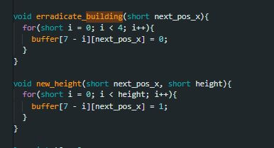

#### Calcular Porcentaje
Para mostrar el porcentaje de cuantos leds tenemos que encender segun los 8 leds que tenemos utilizamos la funcion map, la cual esta nos ayuda respecto a cuantos leds tenemos que encender.

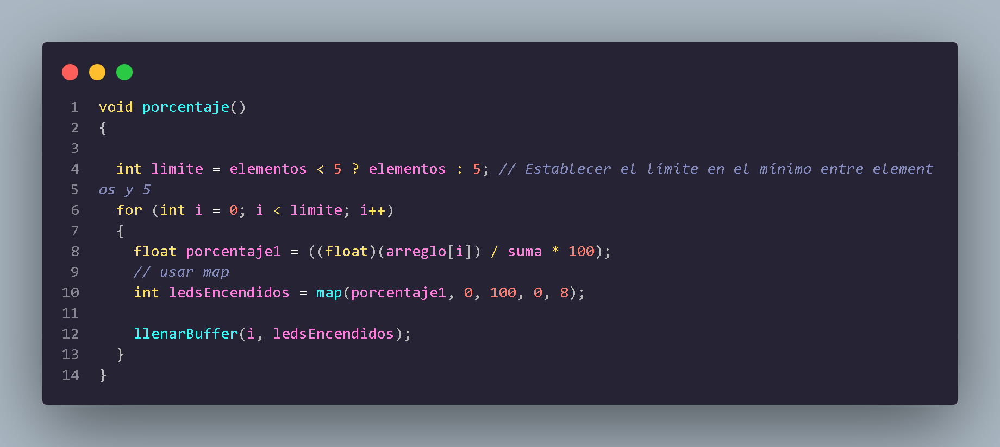

#### Mostrar Clasificacion
  
Este metodo nos ayuda a mostrar la matriz ya con el porcentaje, cuenta con un for y unas sentencias if que nos ayudan a ver en que posicion seran impresas en la matriz las posiciones.

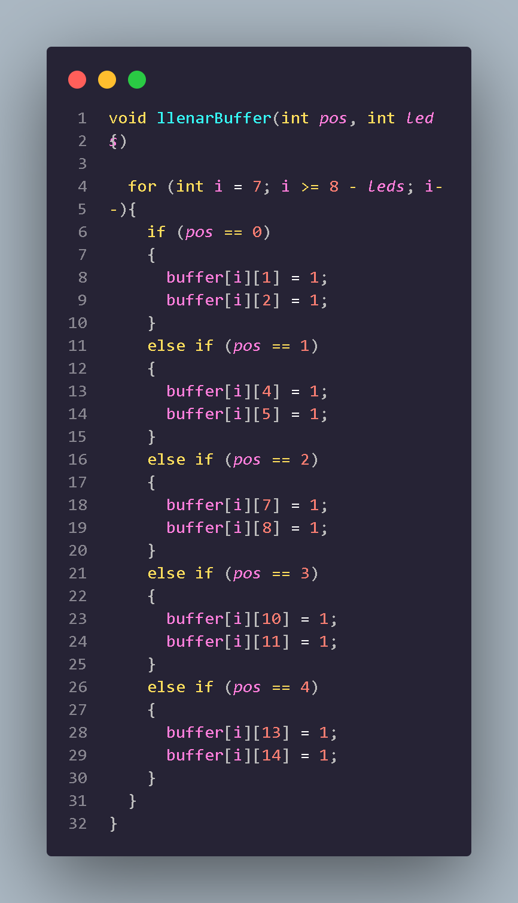

#### Metodo para la clasificacion

para mostrar el top 5 del juego, utilizamos una cola la cual nos ayudara a llevar un control del top, esto lo hacemos mediante un for el cual nos ayuda a ir cambiando el primer dato agregado, ya que se lleva el movimiento de una cola, el primero que entra, el primero que sale

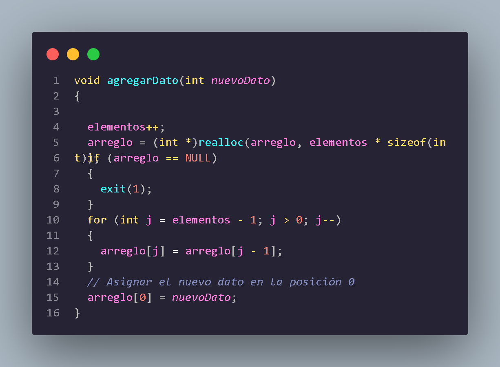

#### Mostrar Matriz
Este metodo tiene la tarea de mostrar una matriz de LEDs los datos que le mandamos. el codigo recorre cada fila y cada columna utilizando dos bucles anidados todos estos con 7 filas y 7 columnas.

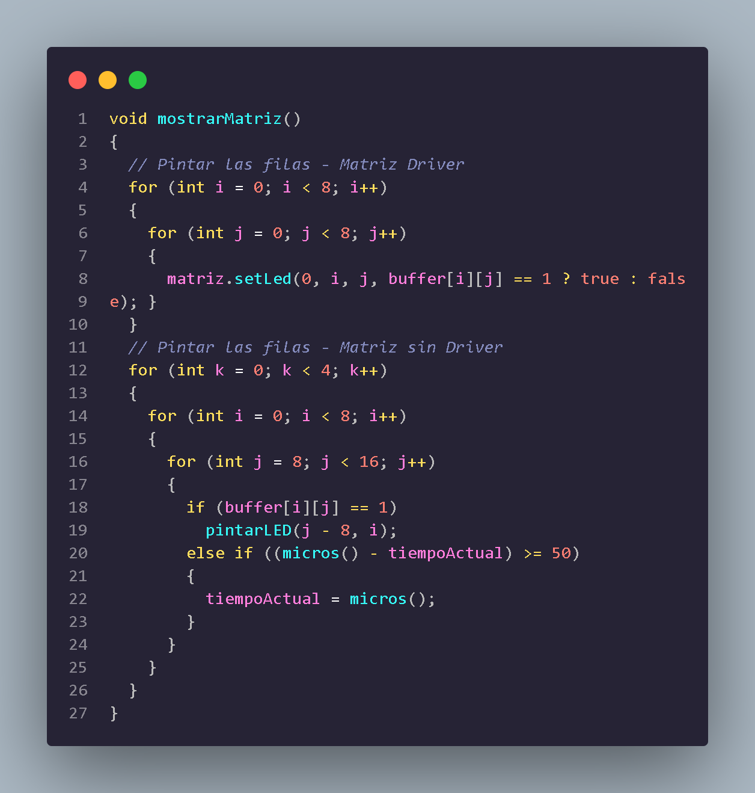

#### Mostrar Configuracion

Para la configuracion y vizualizacion de la matriz contamos con este metodo, el cual borra la configuracion anterior de la matriz, ademas aqui leemos los dos potenciometros conectados, aqui tambien calculamos el valor de la velocidad

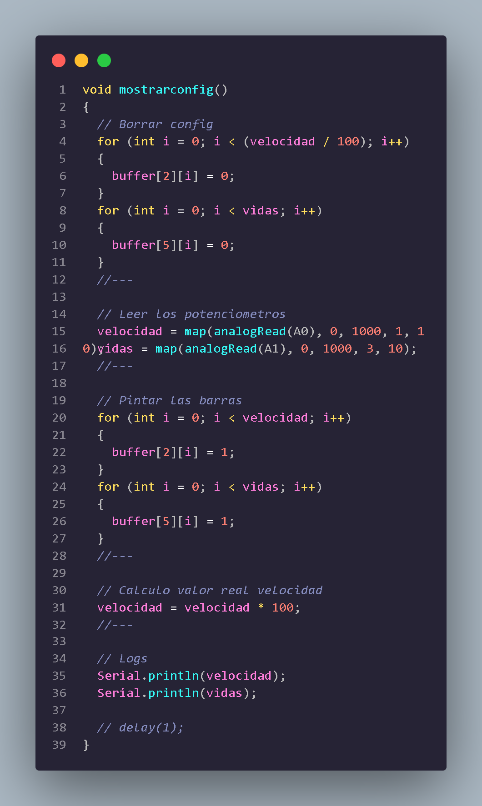

#### Mostrar Menu

En este metodo encontramos la logica necesaria para imprimir el menu que requiere el juego, utilizamos dos bucles for aninados, y por cada posicion se llama a la funcion matriz.setled con los valores requeridos.

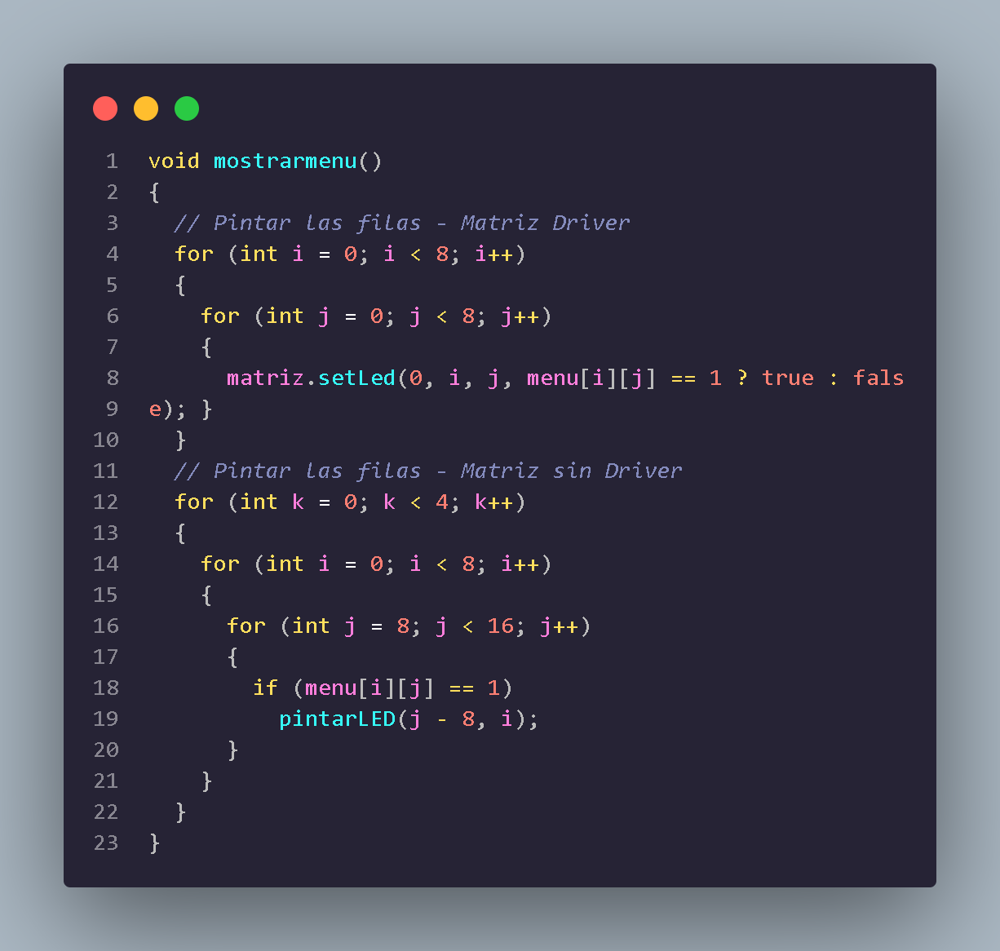

#### Destruir Edificios

Tiene como objetivo destruir los edificios que etan en matriz, se verifica la posicion en y en la ultima fila de la matriz para que asi tengamos el control de la destruccion de edificios, luego si estamos en la posicion y esta es 0 ejecutamos el bucle while de fila 4 a 7, el bucle continua hasta que se encuentra con una posicion vacia en la ultima fila de la matriz.

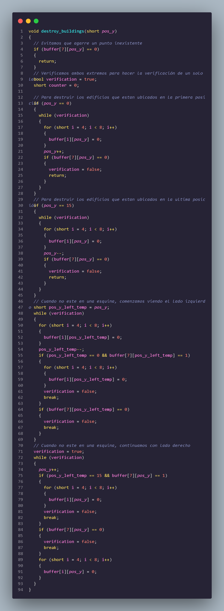

#### Metodo new Game

Aqui encontramos la logica para iniciar un nuevo juego, el metodo comienza inicializando la matriz apagado, luego definidos las variables que estaremos utilizando, como el numero aleatorio de edificios, el espacio inicial, el maximo expacio entre otras, utilizamos un do-while para generar los edificios en el juego, esto dentro del bucle con numeros aleatorios para determinar el tamaño y la posicion de los edificios

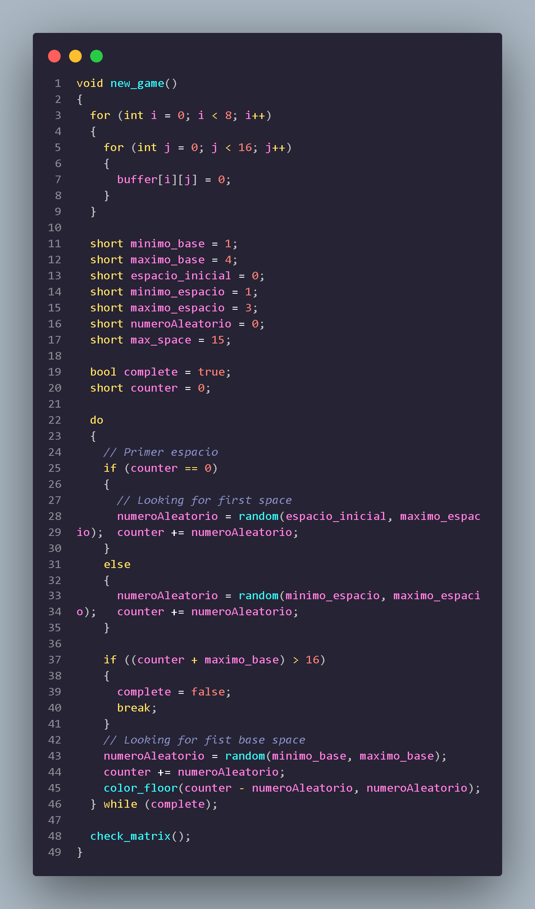

#### Clase Avion

La clase avion encapsula la logica y la representacion de un avion en un juego. Aqui se proporcionan metodos para pintar y borrar la representacion del avion en una matriz y realizar las operaciones relacionada a la posicion y el movimiento. 

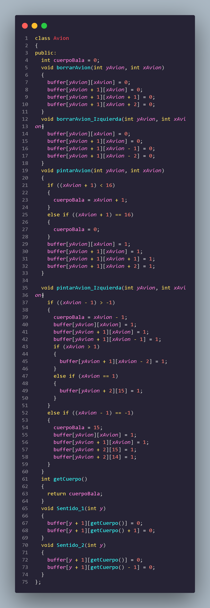

#### Control de vidas

Este metodo se encarga de controlar el numero de vidas que tiene el jugador, realiza las acciones cuando se alcanza la condicion para agregar una vida o cuando el jugador pierde todas sus vidas.

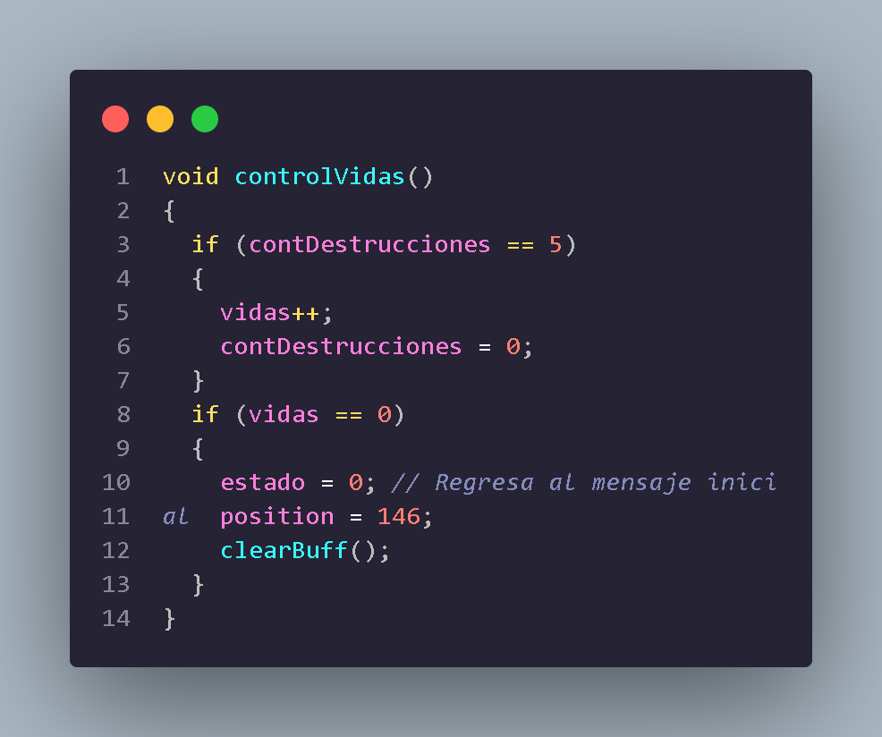
 
#### Loop, flujo del programa

En esta parte tenemos todo el flujo del programa, para comenzar guardamos el valor actual del tiempo en la variable t1 utiliznado millis(), luego utilizamos la variable estado, esta nos ayuda en todo el flujo, si el estado es 0 , mostramos el mensaje inicial, en esta parte controlamos el boton K, el cual si se presiona por unos ciertos segundos realiza unas acciones. Si el estado es 1, muestra el menu principal, aqui tenemos 4 funcionalidades boton D, boton K, boton derecha y boton izquierda, dependiendo del boton seleccionado se ejecutra una accion. si el estado es 2, ejecutamos el juego, si el estado es 3, nos mada a la pantalla de pausa, el estado 4 se encarga de las estadisticas del juego, el estado 5 se encarga de la configuracion del juego.

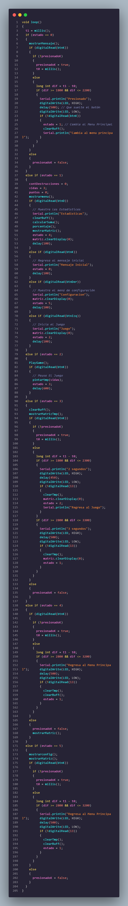

