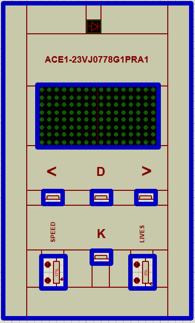
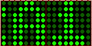
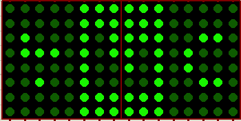
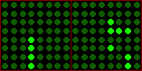
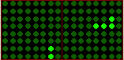
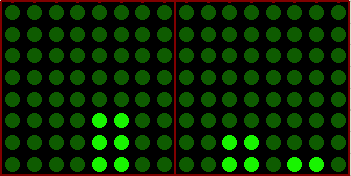
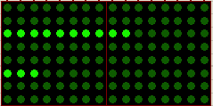
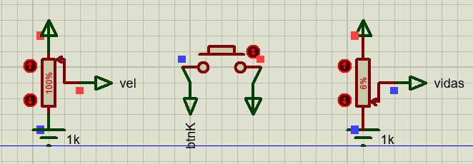
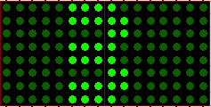
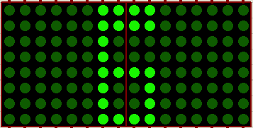

# MANUAL DE USUARIO

## DESCRIPCIÓN DEL DISPOSITIVO

Este es un dispositivo interactivo creado con ArduinoMega que está formado por un display, compuesto por dos matrices LED de 8x8, 2 potenciometros: Vidas, Velocidad y 4 botones para interactuar con el dispositivo, los cuales son: Boton Izquierda(btnIzq), Boton D(btnD), Boton Derecha(btnDer) y Boton K(btnK).
El dispositivo presenta un mensaje inicial de forma dinámica con un efecto de desplazamiento continuo inicial de izquierda a derecha y con la posibilidad de cambiar de dirección con los botones "Izquierda" y "Derecha" como tambien modificar la velocidad con el potenciómetro de "Velocidad".

## USO DEL DISPOSITIVO

### Disposición de los botones

### Mensaje inicial
Al iniciar se muestra el mensaje "pRA1-vJ-2023\<gRUPO I>" de derecha a izquierda en las matrices led, se puede cambiar su dirección presionando el botón "Right" y para cambiarlo de izquierda a derecha se presiona el botón "Left". También se puede la velocidad con la que se muestra el mensaje cambiando el valor de resistencia del Potenciómetro del lado derecho, el valor de 0% es lo más lento que puede ir y el valor 100% es lo más rápido.
>>

### Menú Principal

Para acceder a este menu se debe presionar el boton "K" por 3 segundos, este despliegua las opciones de: ingresar a una nueva partida presionando el boton "Derecha", acceder al menu de configuracion presionando el boton "izquierda", regresar al mensaje inicial presionando el boton "K".

>>

### Juego

Al acceder a una nueva partida iniciara el juevo, se desplegara en pantalla un pequeño avion que tiene la capacidad de disparar balas las cuales podran destruir edificios, estos edificios se generan en ubicaciones aleatorias y cada nivel que se avance se aumentara el numero de edificios. Al destruir todos los edificios el jugador ganara vidas y avanzara a un nuevo nivel, al momento de colisionar con los edificios el avion subira dos posiciones arriba de su posicion actual. El avion tiene la capacidad de cambiar su direccion de izquierda a derecha con los botones correspondientes. El jugador al perder todas su vidas perdera la partida y regresara al menu principal. En cualquier momento el jugador puede acceder al menu de pausa para visualizar sus vidas restantes.

>>

>>

### Menú de Estadisticas

Para acceder a este menu se debe presionar el boton "D" dentro del menu principal. Se deplegara en la pantalla los puntajes de las ultimas 5 partidas que se hayan jugado. Para regresar al menu principal debera presionar el boton "K" por 3 segundos.

>>

>>

### Menú de Configuración

Para acceder a este menu se debe presionar el boton "Derecha" dentro del menu principal. Se deplegara en la pantalla dos valores importantes para el juego, estos son son el numero de vidas que posee el jugador al iniciar una partida, barra inferior, y la velocidad del juego, barra superior. Para regresar al menu principal debera presionar el boton "K" por 3 segundos.

>>

>>

Estos valores son asignados por medio de dos potenciometros situados en el teclado del juego y al momento de mover los potenciometros los valores nuevos son reflejados en la pantalla.

### Menú de Pausa

Para acceder a este menu de pausa se debe presionar el boton "k" por tres segundo dentro de una partida, se deplegara en la pantalla el numero de vidas disponibles por el jugador. Para regresar al juego debera presionar por segundos el boton .

>>

>>

### Nivel

Se deplegara en la pantalla por dos segundos al momento de ganar y pasar a un nuevo nivel en el juego.

>>

>>